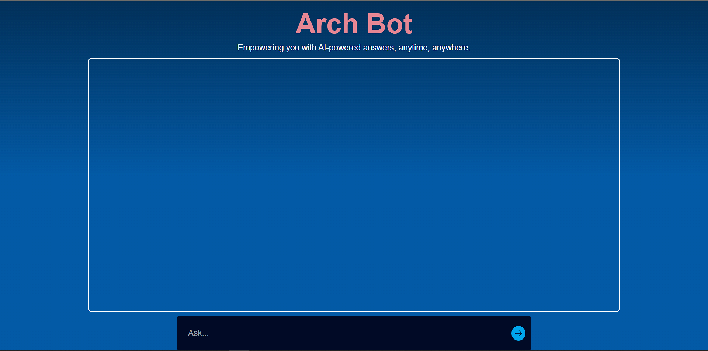
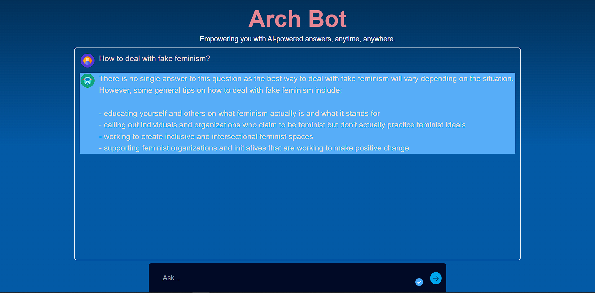
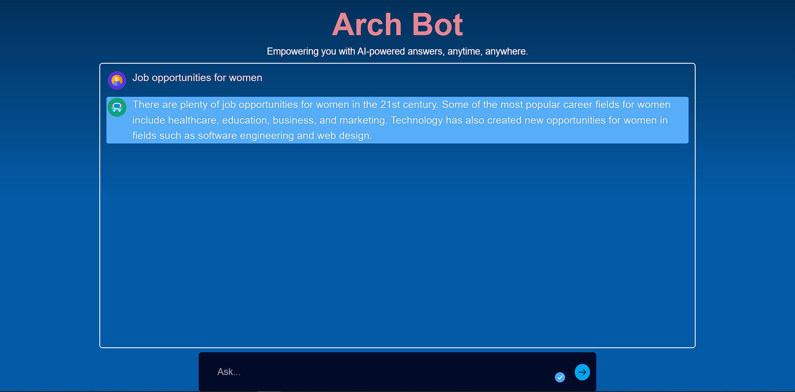
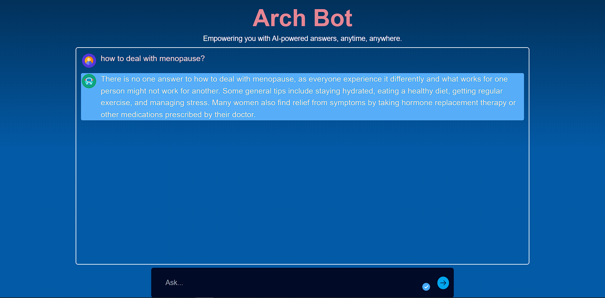

# Arch Bot

_"Empowering you with AI-powered answers, anytime, anywhere."_

The project is chatbot website that utilizes Artificial Intelligence to communicate with user through a chat channel or interface.

The bot will answer all the questions and problems in natural language. Questions which are women and children centric and help towards women empowerment. In the lifespan of a woman she has to face lot of problems that hinders their potential, growth and progress.

The bot will guide or suggest solutions for their various problems and questions.

## Team - VULCAN_FORGE

Members:

1. Nidhish Chauhan
2. Mandar Kamble

> Note: If the website is not responding then the **reload** the page.

## Run Locally

Clone the project:

```bash
    git clone https://github.com/Nidhish-07/Arch-Bot.git
```

Go to respective directories:

```bash
cd client and cd server
```

Install dependencies

```bash
npm install
```

Command to start backend and frontend

```bash
npm run dev
```

## Screenshots





## Technologies Used

1. NodeJS and ExpressJS
2. TailwindCSS
3. OpenAI GPT3 Codex Model(Natural language to OpenAI API)

## Environment Variables

Add this environment variable to your .env to run locally

> OPENAI_API_KEY

[To get the key visit this website](https://beta.openai.com/examples)
